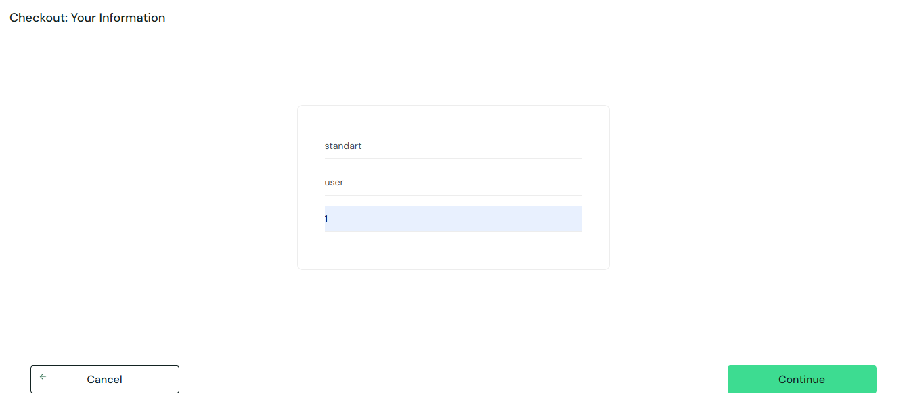
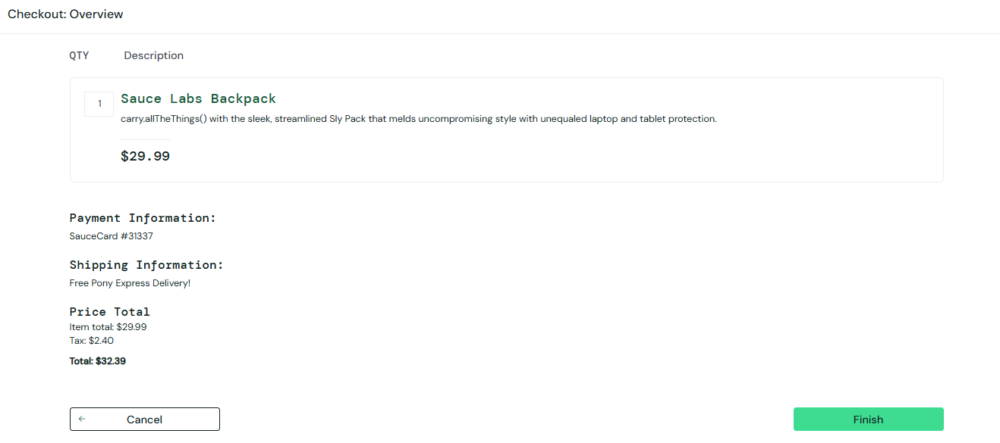
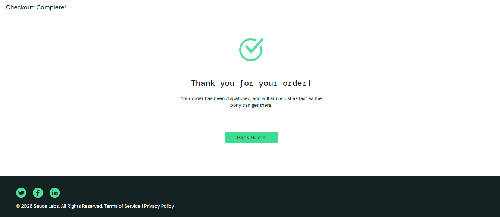
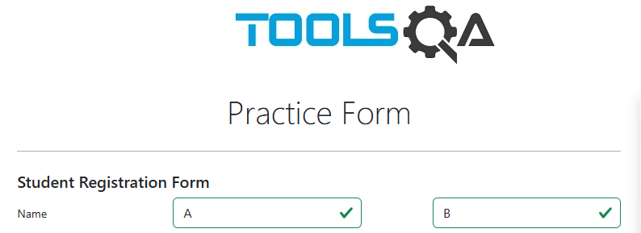

# Bug Reports – Evidence Summary

This module contains evidence of defects identified during test execution.

The reported bugs highlight issues related to calculation errors and input validation failures within the system.

---

## Covered Scenarios

* Incorrect subtotal calculation in the checkout process
* Invalid postal code accepted during checkout
* Form submission allowed with invalid name input

---

Each bug includes a screenshot capturing the exact moment the defect occurs, providing clear and objective visual proof of the issue.

The evidence focuses on demonstrating the problem without unnecessary steps, ensuring efficient communication and analysis.

---

These bug reports reflect real-world testing scenarios, emphasizing the importance of validation rules and accurate system behavior.

# Bug Reports – Evidence

This section contains visual evidence of identified defects during test execution.

Each bug includes a screenshot highlighting the issue observed in the system, focusing on the exact moment the defect occurs.

---

## BUG-01 – Incorrect Subtotal Calculation

The system calculates the subtotal incorrectly after adding products to the cart.

Expected Behavior:
The subtotal should match the sum of the selected product prices.

Actual Behavior:
The displayed subtotal does not correspond to the correct total.

Evidence:

---

## BUG-02 – Postal Code Validation Failure

The system allows proceeding in the checkout process with an invalid postal code containing only 1 digit.

Expected Behavior:
The system should block progression and display a validation error.

Actual Behavior:
The system allows progression to the next step with invalid input.

Evidence:

---

## BUG-03 – Name Field Validation Failure

The system allows form submission with a "Full Name" field containing only 1 character.

Expected Behavior:
The system should reject the input and display a validation message.

Actual Behavior:
The system accepts and submits invalid data.

Evidence:

---

The evidence focuses on capturing the defect clearly and objectively, without unnecessary steps, ensuring efficient communication of the issue.

